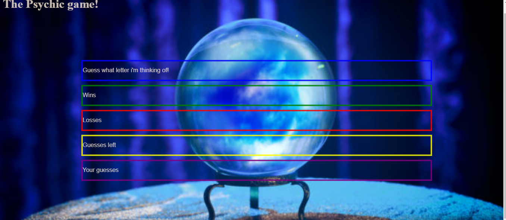

# Psychic-Game
This application is a simple guessing game. The user well have to try and guess the letter that the computer is thinking of. Are you psychic? can you guess the letter?

# Technologies used:
 * html
 * JavaScript
 * jQuery
 
 # Instructions:
* Type a letter on you keyboard.
* Look to see if you guessed the correct or wrong letter.
* If the guess was wrong you will see the letter displayed in the bottom row under "Your guesses".
* If the guess is correct you will recieve a win count.
* The user has nine guesses per round, If the user does not guess the correct letter the loss counter will go up by one.

